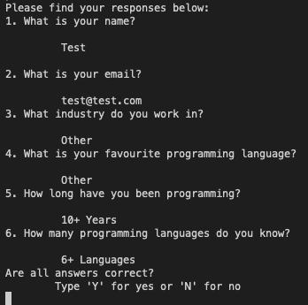
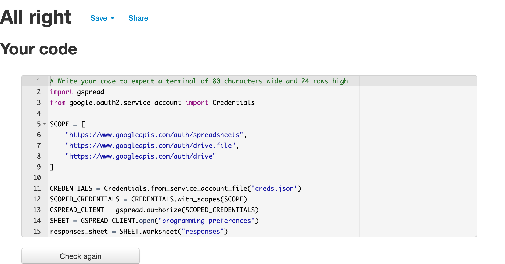

# Programming Preferences
A Python Terminal project designed to allow users to complete a survey regarding their programming background and view the average results of other user responses. 

## Scope / Goals

* The aim for this was project was to write a piece of software that would allow a user to both read-from and write-to the backend Google Sheet that recorded the site's data. To achieve this, two separate main functions were written: one that allowed users to complete the survey themselves, answering all six questions and then having the responses recorded in the datasheet, the second function enabled users to read from the datasheet - namely, enabling them to view the averaged results for the questions which did not contain personal data. 

## Features

* Write-To
    * The write-to portion of the project allows the user to complete the Programming Preferences survey, which consists of six questions. Four of these questions are multiple choice options which allows some analysis to be done with them, with the other two recoding name and email. Once a user has completed all six questions, the answers are automatically recorded in the datasheet allowing for instant updates to the averages that can be read in the Read-From section. Below, one can see a test portion of the write-to section showing a fully completed survey. 
    

* Read-From
    * The read-from section allows the user to view available data from the Programming Preferences survey. It does not return any potentially confidential information, as it can only return data from the multiple choice questions in the survey. 

* User Input Check

## Logic

## Testing / Validation 

* PEP8 Validation
    * 

* Decision Tree Testing
    * To test that the code was working as expected, I ran through the decision tree as many times as possible at different points to see whether or not there were any points that did not work as expected. As the code for many of the questions remained very similar, it was not necessary, or efficient, to test each branch of the decision tree so only main branches were tested.

## Deployment

* The Programmming Preferences project was deployed via Heroku and can be accessed via the webpage's online CLI. The code for the use of the Heroku app is forked from the CI Python Template referenced below.

# References

* [CodeInstitue Python / Heroku Template] (https://github.com/Code-Institute-Org/python-essentials-template)
